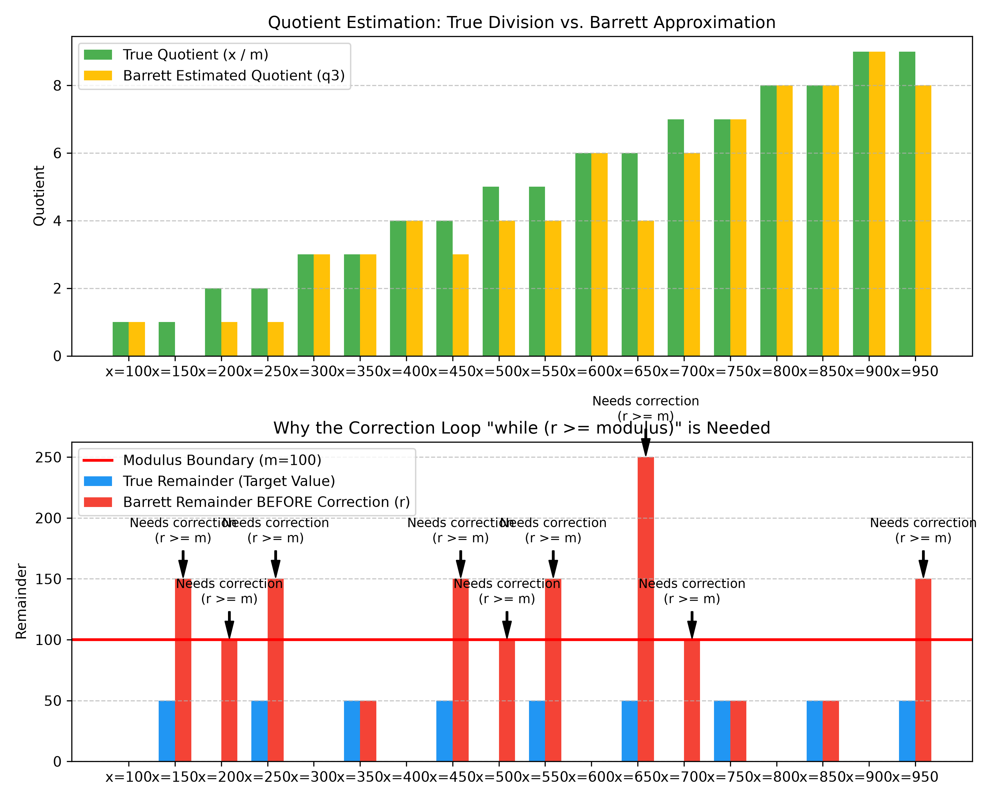
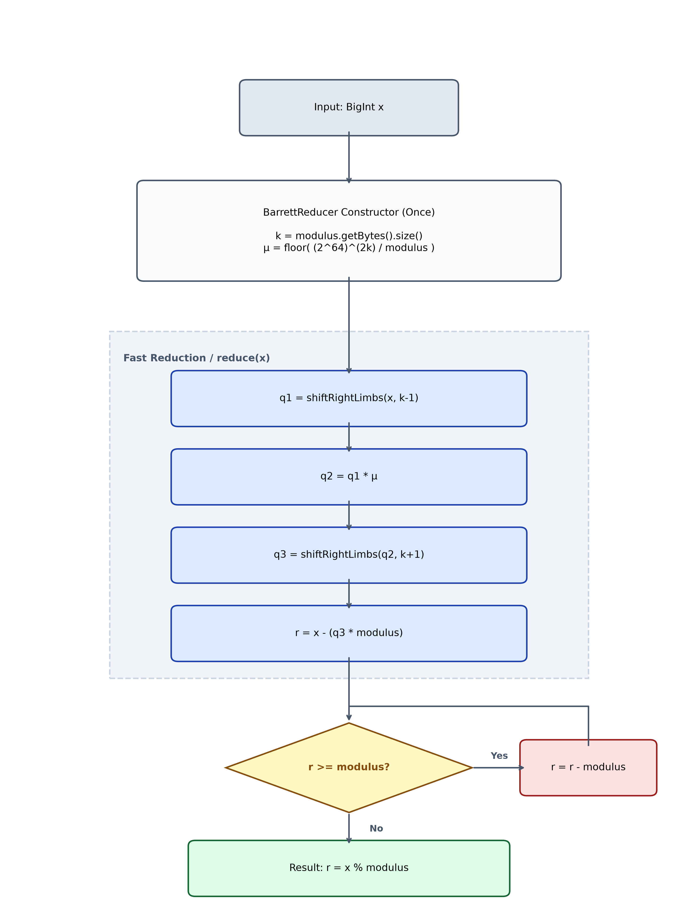

# Barrett Reduction

This module implements **Barrett reduction**, a mathematical technique used to speed up modulo operations on large integers.

---

## 1. What is Barrett Reduction?

In computer science, when working with very large integers (arbitrary-precision arithmetic), traditional division is one of the slowest operations. Calculating a simple remainder $x \pmod m$ normally requires a slow long-division step.

Barrett reduction solves this by replacing the slow division with a combination of fast **multiplication** and **digit shifting** (limb-shifting).

### The Core Concept:
To find the remainder of $x$ divided by $m$, we want to find the quotient $q = \lfloor x / m \rfloor$. Instead of dividing $x$ by $m$, we can multiply $x$ by the "inverse" of $m$ (i.e., $1/m$).

Since we work with integers, we scale this inverse up to make it an integer. Let $b = 2^{64}$ represent our base (since each "limb" or array element in our code is a 64-bit integer), and let $k$ be the number of limbs in the modulus $m$.

1. **Precomputation:**
   We precalculate a scaling constant, $\mu$ (mu):
   $$\mu = \lfloor \frac{b^{2k}}{m} \rfloor$$
   This is the only actual division we need to perform, and it is done once when initializing the reducer.

2. **Estimating the Quotient:**
   To calculate the modulo, we estimate the quotient $q$. Instead of full multiplication, we use a slightly adjusted formula to keep the numbers from growing too large:
   $$q \approx \lfloor \frac{\lfloor x / b^{k-1} \rfloor \cdot \mu}{b^{k+1}} \rfloor$$
   In code, dividing by $b^{k-1}$ and $b^{k+1}$ is done using simple right-shifts of the array elements (limbs).

3. **Calculating the Remainder and Correcting:**
   Once we have our estimated quotient $q$, we calculate the remainder:
   $$r = x - (q \cdot m)$$
   Because we used an approximation, our estimated quotient might be slightly smaller than the actual quotient (by at most 2). Consequently, the temporary remainder $r$ might still be larger than our modulus $m$. We correct this by subtracting $m$ from $r$ until $r < m$ (which is guaranteed to happen in at most two steps).

---

## 2. Estimation and Final Correction

To understand how the mathematical approximation interacts with the final adjustment loop, we can look at how the estimate behaves.

### Visualizing the Process:
The following diagram illustrates how the algorithm behaves:

* **Top Graph (Quotient Estimation):** Shows that the estimated quotient (due to rounding down during limb-shifts) occasionally falls slightly below the actual quotient.
* **Bottom Graph (Remainder Progress):** Shows the preliminary remainder $r$. Whenever the estimated quotient is slightly too small, the temporary remainder $r$ crosses the red line (the modulus $m$). In these instances, the correction loop subtracts $m$ until the remainder is brought within the correct bounds.

---

## 3. Algorithm Flowchart

The step-by-step control flow is represented in the diagram below:

### Summary of Steps in Code:
1. **Shortcut check:** If the input $x$ is already smaller than the modulus $m$, return $x$ immediately.
2. **First shift:** Shift $x$ right by $k-1$ limbs to get $q_1$.
3. **Multiply:** Multiply $q_1$ by our precomputed value $\mu$ to get $q_2$.
4. **Second shift:** Shift $q_2$ right by $k+1$ limbs to get our final estimated quotient, $q_3$.
5. **Find remainder:** Calculate $r = x - (q_3 \cdot m)$.
6. **Adjust:** While $r \geq m$, subtract $m$ from $r$ (runs at most twice).
7. **Return:** Return the final reduced value $r$.